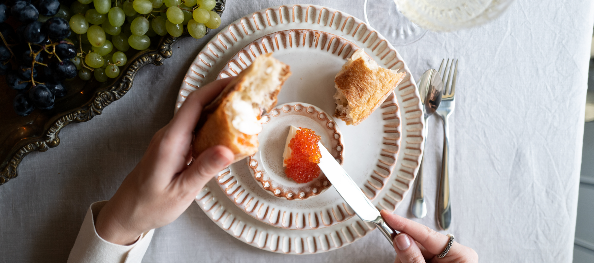
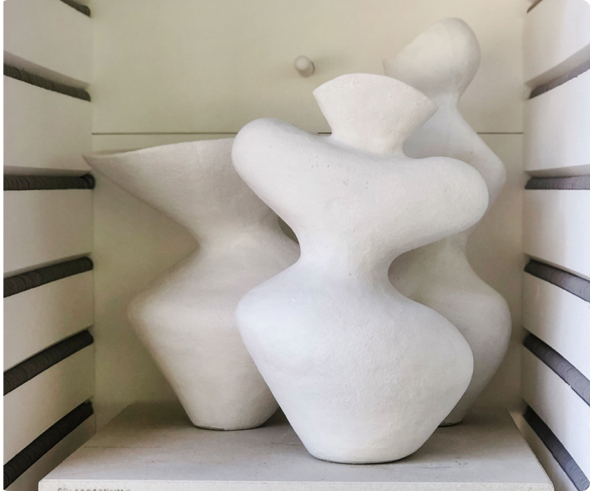
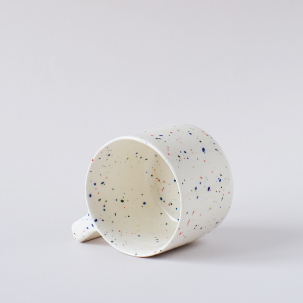
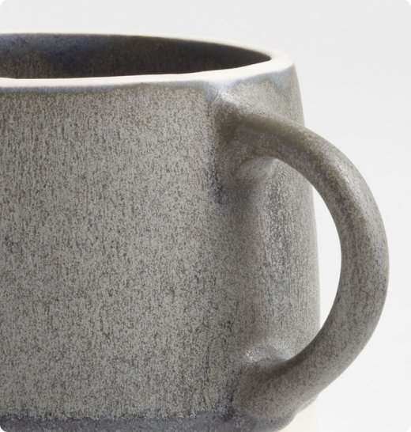

# CLAY-MADE

###### Интернет-магазин керамической посуды CLAY-MADE
____

Сегодня наш интернет-магазин является одним из лучших мест для покупки керамических изделий ручной работы. Мы стремимся сохранять традиции ручной работы, одновременно внедряя новые технологии и идеи.

 |  | 

Интернет-магазин состоит из 4 страниц. На главной представлена общая информация о магазине, интерактивный слайдер, и форма для подписки на рассылку. На странице каталога представлены товары. Каждую карточку товара можно открыть в виде Попапа, а также добавить любой товар в корзину. Есть две страницы с дополнительной информацией для клиентов: "доставка и оплата" и "о нас". На сайте есть модальные окона (попапы) не только для карточек товаров, но и для входа/регистрации и благодарности за подписку на рассылку.

|  |  |  |
|--------------------------------------------|:--------------------------------:|--------------------------------------------:|
|  |                |   |

## База данных: [dbdiagram](https://dbdiagram.io/d/644eaf35dca9fb07c4485186)
